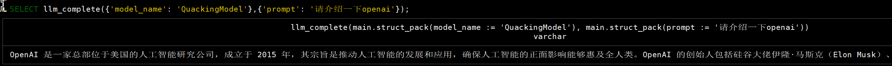

# 快速开始


创建 OpenAI API key

```sql
CREATE SECRET (TYPE OPENAI, BASE_URL 'https://open.bigmodel.cn/api/paas/v4/', API_KEY 'a293bce4644c49a890ff365c799189d5.LzYZaabAgWbXTLeb');

```

创建模型
```sql
CREATE MODEL('QuackingModel', 'glm-4-air', 'openai', {"context_window":128000,"max_output_tokens":8400});
```

```sql
SELECT llm_complete({'model_name': 'QuackingModel'},{'prompt': '请介绍一下openai'});
```




对于具有openai兼容API的提供者，指定BASE_URL以及API密钥，为了说明这一点，我们将使用groq作为示例。您只需要两个必要步骤：

首先，通过指定其BASE_URL和API_KEY，为groq提供程序创建一个Secret

https://groq.com/

```sql
CREATE SECRET (
    TYPE OPENAI,
    BASE_URL 'https://api.groq.com/openai/v1/chat/completions',
    API_KEY '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'
);
       
CREATE MODEL(
   'GeoFerModel',
   'qwen-qwq-32b', 
   'openai', 
   {"context_window": 128000, "max_output_tokens": 8400}
);

SELECT llm_complete(
    {'model_name': 'GeoFerModel'},
    {'prompt': '你是谁'}
);
```


