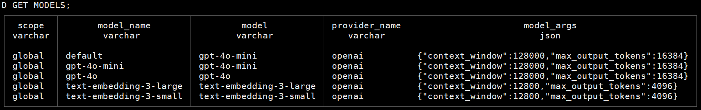
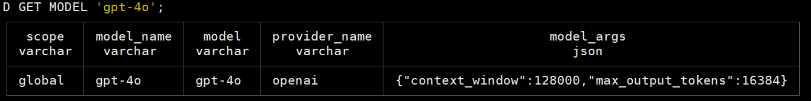
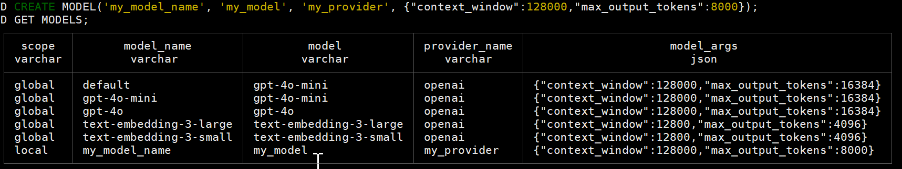
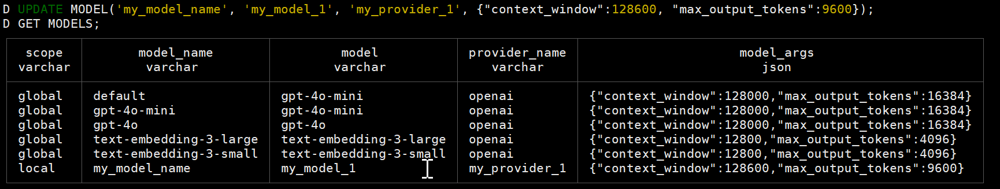
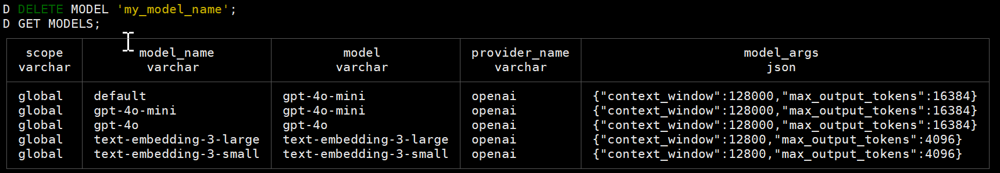
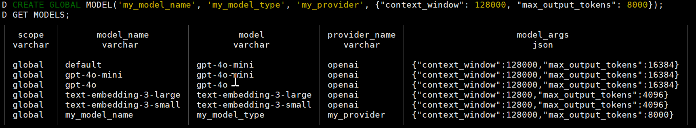
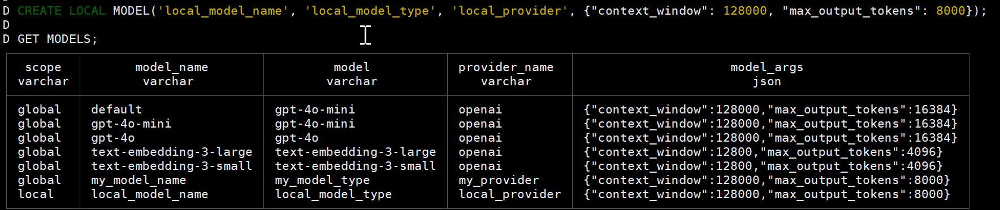
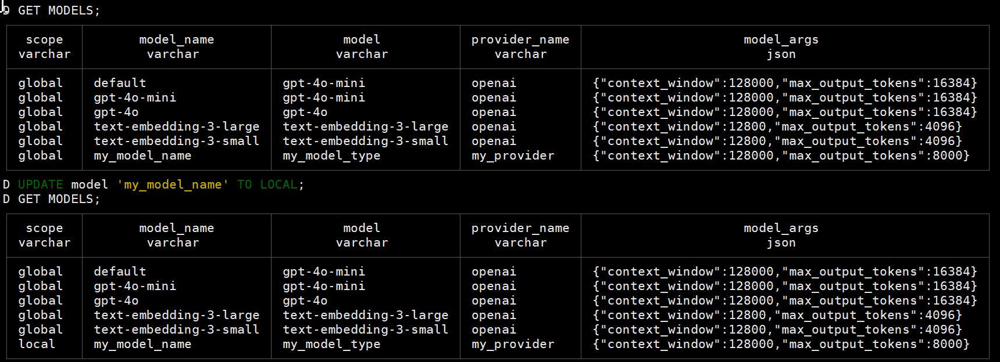

# 模型管理

模型管理提供了关于如何在 GeoFer 中如何配置和管理模型。模型包含系统定义的和用户自定义的两类模型。
在初始加载时，每个数据库都配置有模型管理表。

## 一、模型配置

模型表结构如下


| 列名            | 描述                                                   |
|---------------|------------------------------------------------------|
| model_name    | 模型名称，唯一标识符                                           |
| model         | 模型类型，例如 gpt-4， llama3                                |
| provider_name | 模型来源，例如 openai, ollama                               |
| model_args    | 模型参数配置，json 结构，包含 context_window 和 max_output_tokens |


## 二、模型管理命令

获取所有可用模型
```sql
GET MODELS;
```



获取模型详细信息
```sql
GET MODEL 'model_name';
```



创建自定义模型
```sql
CREATE MODEL('my_model_name', 'my_model', 'my_provider', {"context_window":128000,"max_output_tokens":8000});
```




修改自定义模型
```sql
UPDATE MODEL('my_model_name', 'my_model_1', 'my_provider_1', {"context_window":128600, "max_output_tokens":9600});
```



删除自定义模型
```sql
DELETE MODEL 'my_model_name';
```



模型创建是特定于数据库的，如果希望它不管数据库是什么，它都可用，需要将其设置为 GLOBAL 模式。
上述创建的模型是特定于正在运行的数据库，默认情况下是 LOCAL, 关键字 LOCAL 是可选的

LOCAL 模式一旦退出，模型即消失，因为在内存中
GLOBAL 模型则会保留

创建全局模型
```sql
CREATE GLOBAL MODEL('my_model_name', 'my_model_type', 'my_provider', {"context_window": 128000, "max_output_tokens": 8000});
```



创建本地模型, 创建模型默认就是 local 模式

```sql
CREATE LOCAL MODEL('local_model_name', 'local_model_type', 'local_provider', {"context_window": 128000, "max_output_tokens": 8000});
CREATE MODEL('model_name', 'model_type', 'provider', {"context_window": 128000, "max_output_tokens": 8000});
```



切换模型全局和本地状态

```sql
UPDATE MODEL 'local_model_name' TO GLOBAL;
UPDATE MODEL 'model_name' TO LOCAL;
```



