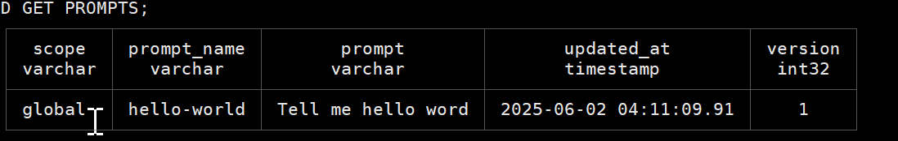
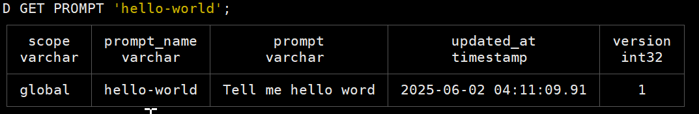
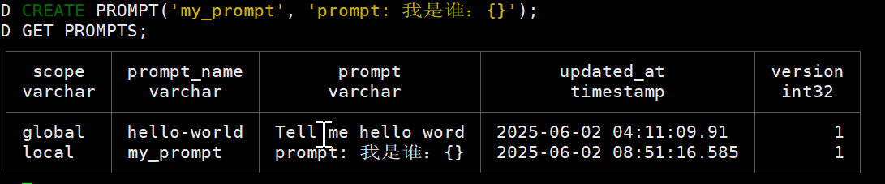
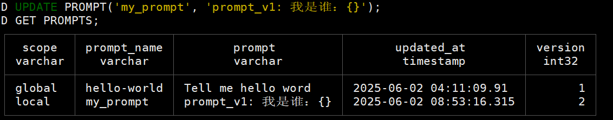
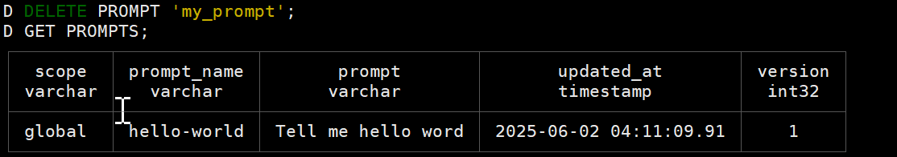
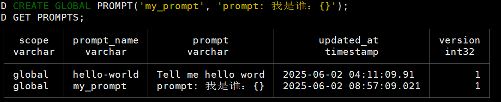
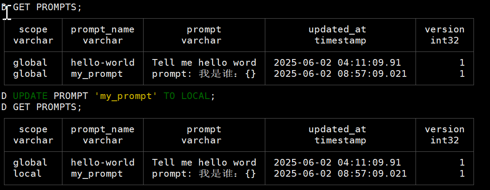

# Prompt 管理

表结构

| 列名          | 描述             |
|-------------|----------------|
| prompt_name | prompt名称，唯一标识符 |
| prompt      | prompt内容       |
| updated_at  | 更新时间戳          |
| version     | 版本号            |


获取全部的 Prompts

```sql
GET PROMPTS;
```




获取单个 prompt 详情

```sql
GET PROMPT 'hello-world';
```




创建新的 prompt 
```sql
-- 默认 local 模式
CREATE PROMPT('my_prompt', 'prompt: 我是谁：{}');
```




修改一个已存在的 prompt
```sql
UPDATE PROMPT('my_prompt', 'prompt_v1: 我是谁：{}');
```



删除一个 prompt
```sql
DELETE PROMPT 'my_prompt';
```




Prompt创建是数据库特定的，如果您希望它是可用的，而不管数据库，然后使其成为一个全局模式。
默认情况下是LOCAL，关键字LOCAL是可选的。

创建全局 Prompt
```sql
CREATE GLOBAL PROMPT('my_prompt', 'prompt: 我是谁：{}');
```



创建局部 Prompt
```sql
CREATE LOCAL PROMPT('prompt_name', 'prompt');
CREATE PROMPT('prompt_name', 'prompt');
```

切换 prompt 状态
```sql
UPDATE PROMPT 'my_prompt' TO LOCAL;
UPDATE PROMPT 'my_prompt' TO GLOBAL;
```

