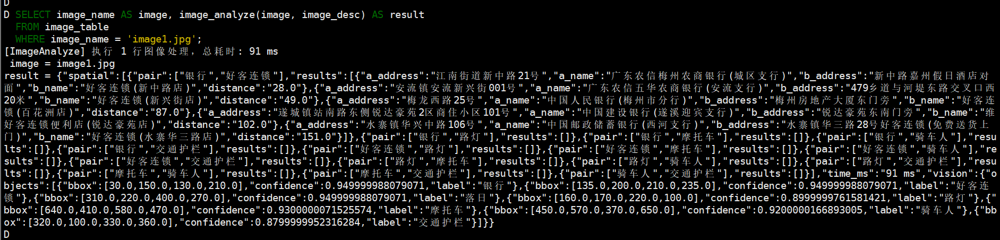

## 编译步骤

参考 [这里](../README.md)

## 执行步骤

### 一、进入 duckdb
```bash
# 进入 duckdb
cd ./build/release
./duckdb geo.db
```

### 二、查看可用扩展
```sql
SELECT extension_name, installed, description
FROM duckdb_extensions(),
```

三、基础命令

输出数据库
```sql
SHOW databases,
```

输出当前 schema 的表
```sql
SHOW tables,
```

输入所有的表
```sql
SHOW ALL tables
```


查询当前 schema
```sql
select current_schema(),
```

设置当前 schema
```sql
SET schema=geofer_config,
```


### 三、启动 YOLO 推理服务

```
启动 yolo 目录 main 函数即可
```

### 四、图片推理

准备数据：geo_bk.sql geo_hk.sql
```sql
./duckdb geo.db

CREATE TABLE image_table (
    image_name TEXT,         -- 图片名
    image BLOB,              -- 图片二进制数据
    image_desc TEXT          -- 图片描述信息
);

INSERT INTO image_table
    SELECT
    'image1.jpg' AS image_name,
    content AS image,
    'image1 描述' AS image_desc
FROM read_blob('/home/zrp/workdir/image1.jpg');
INSERT INTO image_table
SELECT
    'image2.jpg' AS image_name,
    content AS image,
    'image2 描述' AS image_desc
FROM read_blob('/home/zrp/workdir/image2.jpg');
```

spatial 经纬度扩展
```sql
INSTALL spatial;    
LOAD spatial;
CREATE TABLE geo_table (
   id TEXT PRIMARY KEY,
   name TEXT,
   address TEXT,
   location GEOMETRY,
   pcode INTEGER,
   adcode INTEGER,
   pname TEXT,
   cityname TEXT,
   type TEXT,
   typecode TEXT,
   adname TEXT,
   citycode INTEGER
);
```

导入数据
```sql
.read init.sql
.read geo_hk.sql
.read geo_bk.sql
```


SQL 验证
```sql
WITH geo_a AS ( 
    SELECT * FROM geo_table WHERE name LIKE '%好客连锁%'
), geo_b AS ( 
    SELECT * FROM geo_table WHERE name LIKE '%银行%'
)
SELECT 
    a.name AS a_name, 
    a.address AS a_address, 
    b.name AS b_name, 
    b.address AS b_address, 
    ROUND((st_distance(a.location, b.location) / 0.0111) * 1000) AS distance 
FROM geo_a AS a 
JOIN geo_b AS b ON 1=1
WHERE 1=1 AND ST_X(a.location) <= ST_X(b.location) AND distance > 1 AND distance < 100
ORDER BY distance
LIMIT 5;
```

```sql
.mode duckbox    -- 默认模式
.mode column
.mode csv       -- csv 模式
.mode json     -- json 模式  内容完整
.mode line     --  一行 一条数据， 内容完整，推荐使用

LOAD spatial;

SELECT image_name AS image, image_analyze(image, image_desc) AS result
FROM image_table
WHERE image_name = 'image1.jpg';

SELECT image_name AS image, image_analyze(image, image_desc) AS result
FROM image_table
WHERE image_name = 'image2.jpg';

SELECT image_name AS image, image_analyze(image, image_desc) AS result
FROM image_table
WHERE image_name = 'image1.jpg' or image_name = 'image2.jpg';
```




```sql
COPY (
    SELECT image_analyze(image, image_desc) AS result
    FROM image_table
    WHERE image_name = 'image1.jpg'
) TO 'output.json' (FORMAT JSON);
```

```sql
WITH geo_a AS ( 
    SELECT * FROM geo_table WHERE name LIKE '%<entity_a>%'
), geo_b AS ( 
    SELECT * FROM geo_table WHERE name LIKE '%<entity_b>%'
)
SELECT 
    a.name AS a_name, 
    a.address AS a_address, 
    b.name AS b_name, 
    b.address AS b_address, 
    ROUND((st_distance(a.location, b.location) / 0.0111) * 1000) AS distance 
FROM geo_a AS a 
JOIN geo_b AS b ON 1=1
WHERE 1=1 AND distance > 1 AND distance < 100 {AND ST_X(a.location) <= ST_X(b.location)} 
ORDER BY distance
LIMIT 5;
```

curl --location --request POST 'http://192.168.56.1:8080/api/v1/image_analyze' \
--form 'description='xxx'' \
--form 'file=@'/home/zrp/workdir/image1.jpg''


```json
{"spatial":[{"pair":["银行","好客连锁"],"results":[{"a_address":"江南街道新中路21号","a_name":"广东农信梅州农商银行(城区支行)","b_address":"新中路嘉州假日酒店对面","b_name":"好客连锁(新中路店)","distance":"28.0"},{"a_address":"安流镇安流新兴街001号","a_name":"广东农信五华农商银行(安流支行)","b_address":"479乡道与河堤东路交叉口西20米","b_name":"好客连锁(新兴街店)","distance":"49.0"},{"a_address":"梅龙西路25号","a_name":"中国人民银行(梅州市分行)","b_address":"梅州房地产大厦东门旁","b_name":"好客连锁(百花洲店)","distance":"87.0"}]},{"pair":["银行","人"],"results":[{"a_address":"人民中路51号","a_name":"中国工商银行(陆河支行)","b_address":"河田镇人民北路","b_name":"中国人民银行(陆河县支行)","distance":"15.0"},{"a_address":"都城镇新生东路86号右","a_name":"中国建设银行(郁南营业室)","b_address":"锦秀路2号","b_name":"中国人民银行(郁南县支行)","distance":"40.0"},{"a_address":"人民路168号","a_name":"中国银行(茂名信宜人民路支行)","b_address":"人民路129号信宜邮电大厦F1层","b_name":"中国邮政储蓄银行(人民路支行)","distance":"44.0"},{"a_address":"人民大道中路41号","a_name":"中国工商银行(湛江开发区支行)","b_address":"人民大道中43号银海公寓旁边","b_name":"中国人民银行(湛江市分行)","distance":"63.0"},{"a_address":"浈江路76号","a_name":"中国银行(南雄支行)","b_address":"林荫西路28号","b_name":"中国人民银行(南雄市支行)","distance":"71.0"}]},{"pair":["银行","人"],"results":[{"a_address":"人民中路51号","a_name":"中国工商银行(陆河支行)","b_address":"河田镇人民北路","b_name":"中国人民银行(陆河县支行)","distance":"15.0"},{"a_address":"都城镇新生东路86号右","a_name":"中国建设银行(郁南营业室)","b_address":"锦秀路2号","b_name":"中国人民银行(郁南县支行)","distance":"40.0"},{"a_address":"人民路168号","a_name":"中国银行(茂名信宜人民路支行)","b_address":"人民路129号信宜邮电大厦F1层","b_name":"中国邮政储蓄银行(人民路支行)","distance":"44.0"},{"a_address":"人民大道中路41号","a_name":"中国工商银行(湛江开发区支行)","b_address":"人民大道中43号银海公寓旁边","b_name":"中国人民银行(湛江市分行)","distance":"63.0"},{"a_address":"浈江路76号","a_name":"中国银行(南雄支行)","b_address":"林荫西路28号","b_name":"中国人民银行(南雄市支行)","distance":"71.0"}]},{"pair":["银行","集团"],"results":[{"a_address":"南恩街道漠江路458号-1","a_name":"中国邮政储蓄银行(漠江营业所)","b_address":"漠江路马南垌","b_name":"中国邮政集团公司阳江市漠江营业处","distance":"2.0"},{"a_address":"金鸡镇迎宾路4号","a_name":"中国邮政储蓄银行(金鸡支局)","b_address":"金鸡镇迎宾路4号","b_name":"中国邮政集团公司广东省罗定市金鸡支局","distance":"14.0"},{"a_address":"宁新街道办事处大岭街201号","a_name":"中国邮政储蓄银行(宁新营业所)","b_address":"宁新办事处大岭街中段","b_name":"中国邮政集团公司广东省兴宁市宁新支局","distance":"16.0"}]},{"pair":["好客连锁","人"],"results":[{"a_address":"梅州房地产大厦东门旁","a_name":"好客连锁(百花洲店)","b_address":"梅龙西路25号","b_name":"中国人民银行(梅州市分行)","distance":"87.0"}]},{"pair":["人","人"],"results":[{"a_address":"人民路129号信宜邮电大厦F1层","a_name":"中国邮政储蓄银行(人民路支行)","b_address":"人民路168号","b_name":"中国银行(茂名信宜人民路支行)","distance":"44.0"},{"a_address":"人民大道中45附近","a_name":"中国人民银行湛江市中心支行行政服务大厅(湛江市征信中心西)","b_address":"人民大道中43号银海公寓旁边","b_name":"中国人民银行(湛江市分行)","distance":"75.0"}]}],"time_ms":"219 ms","vision":{"objects":[{"bbox":[845.9051513671875,223.75245666503906,1099.426513671875,346.48748779296875],"confidence":0.9813005924224854,"label":"夕阳"},{"bbox":[0.01639573648571968,189.40289306640625,179.63902282714844,324.76458740234375],"confidence":0.9395243525505066,"label":"银行"},{"bbox":[339.0027160644531,415.1273498535156,383.39410400390625,478.16033935546875],"confidence":0.9115826487541199,"label":"电动车"},{"bbox":[608.7208251953125,309.1570129394531,691.7818603515625,357.8353576660156],"confidence":0.8911973237991333,"label":"好客连锁"},{"bbox":[387.0172424316406,408.9383850097656,439.5384826660156,477.4620056152344],"confidence":0.8864029049873352,"label":"电动车"},{"bbox":[1185.3082275390625,409.82781982421875,1231.9344482421875,495.4731750488281],"confidence":0.8521294593811035,"label":"人"},{"bbox":[590.1336669921875,399.7720642089844,620.0263671875,456.83380126953125],"confidence":0.8303730487823486,"label":"人"},{"bbox":[1232.460693359375,305.431884765625,1267.9962158203125,341.11114501953125],"confidence":0.7850607633590698,"label":"集团"},{"bbox":[1398.0443115234375,229.0454559326172,1540.938720703125,295.52532958984375],"confidence":0.766565203666687,"label":"假日酒店"},{"bbox":[996.8342895507813,398.3818359375,1102.094482421875,491.8935546875],"confidence":0.7530678510665894,"label":"小汽车"}]}}
```